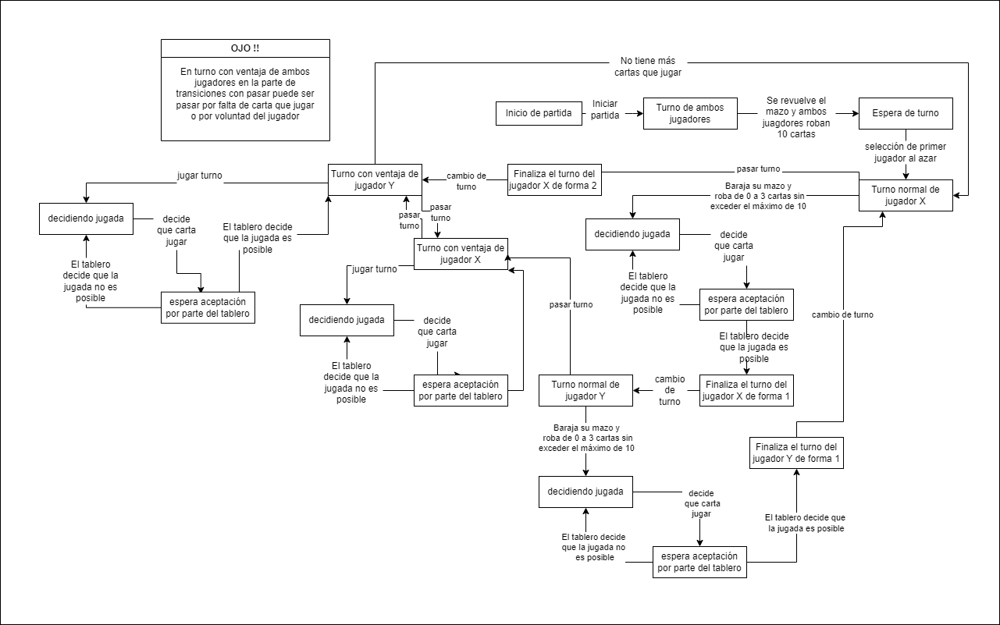

# Gwen't

This work is licensed under a
[Creative Commons Attribution 4.0 International License](http://creativecommons.org/licenses/by/4.0/)

Contexto
Para esta entrega parcial se está en proceso de diseño del controlador a partir del State Pattern.

Las funciones del controlador permiten los distintos estados del juego, el cual se observa en el siguiente diagrama
de estados:

This project's goal is to create a (simplified) clone of the
[_Gwent_](https://www.playgwent.com/en)card game developed by [_CD PROJEKT RED_](https://cdprojektred.com/en/)
